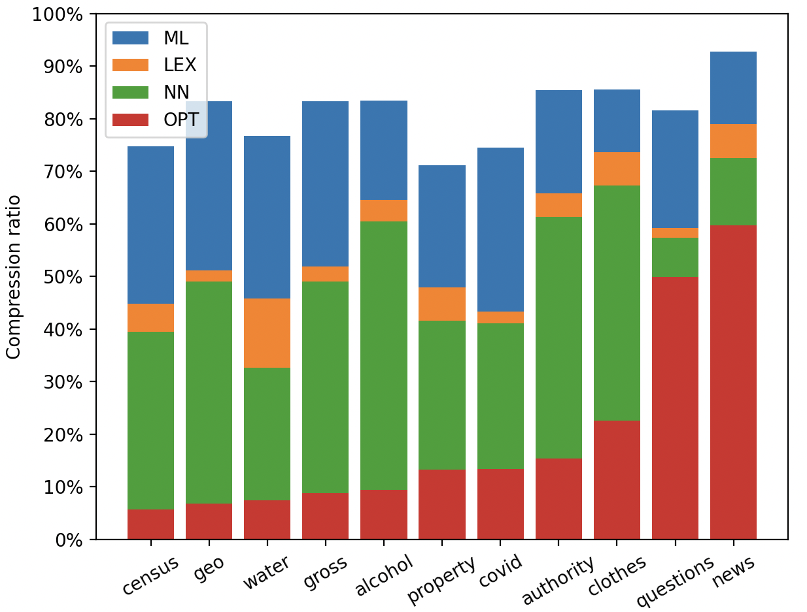
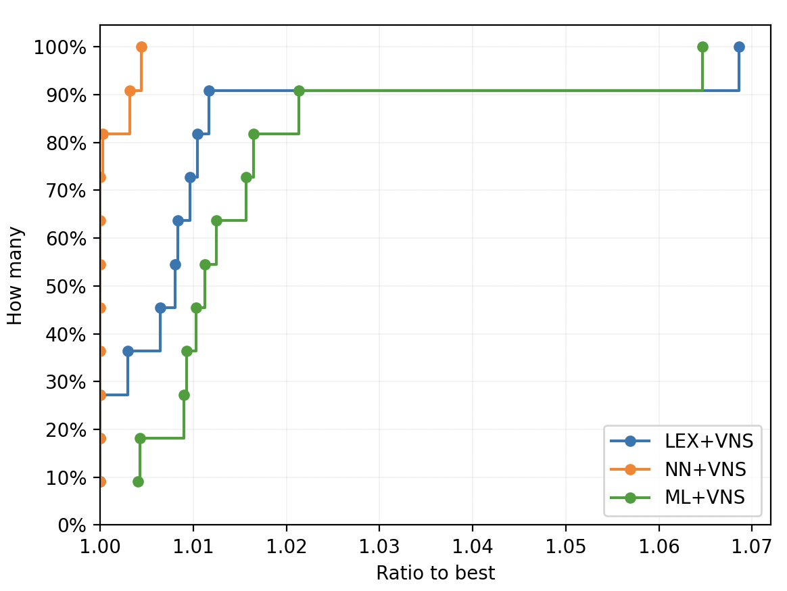
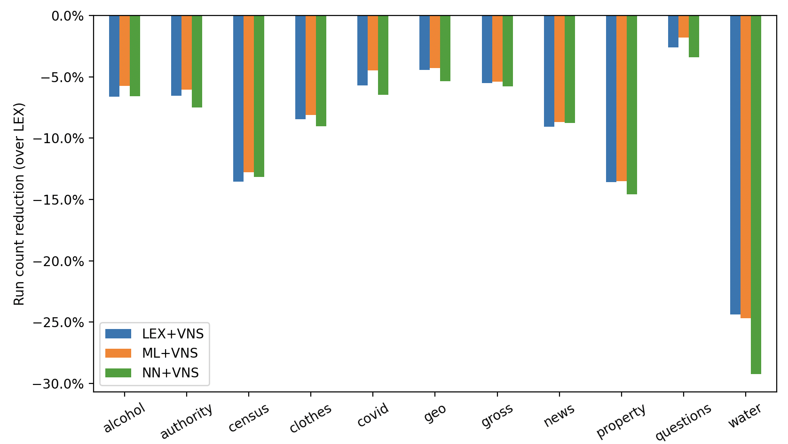

# Run-Length Encoding compression
This repository contains [heuristics](https://en.wikipedia.org/wiki/Heuristic_(computer_science)), [metaheuristics](https://en.wikipedia.org/wiki/Metaheuristic) and
benchmarking scripts for enhancing the [Run-Length Encoding](https://en.wikipedia.org/wiki/Run-length_encoding) in a database.
The main degree of freedom after column reordering is row reordering.
To this end, the algorithms implemented here try to _find the permutation of rows that minimize the number of run counts in a database_.
In other words, we want to maximize the number of ideantical values that appear in every column.

Heuristics explored in this project:
- [Lexicographical order](https://en.wikipedia.org/wiki/Lexicographic_order) (LEX)
- [Nearest Neighbor algortihm](https://en.wikipedia.org/wiki/Nearest_neighbour_algorithm) (NN)
- [Multi-List](https://dl.acm.org/doi/pdf/10.1145/2338626.2338633) (ML)

Metaheuristics explored in this project:
- [Variable Neighborhood Search](https://en.wikipedia.org/wiki/Variable_neighborhood_search) with [2-opt](https://en.wikipedia.org/wiki/2-opt)

## Getting started

Start by cloning the repository:
```
git clone https://github.com/fsossai/rle-compression
```
Make sure all required python packages are available:
```
pip install -r requirements.txt
```
Most of the algorithms are implemented in C++17.
To compile the sources just run `make`. To use g++ instead of clang++ run `make CC=g++`.

## Compressing

The compressor (`compress.py`) works with JSON and CSV files.
```
python compress.py mydb.csv
```
will create a file named `mydb.tar` that can decompressed with `python decompress.py mydb.tar`.

To explore the performance of the heuristics and combine them together use the option `--pipeline` or `-p` for short:
```
python compress.py random_dbs/db_N10k_M10_R10.csv -t 10 -p rand nn vns
```
This will shuffle the database (rand) and its output will be piped to NN and VNS, in this order.
The time limit `-t` is a parameter associated with VNS only.
At the end of the execution a summary note will be produced. E.g.:
```
┌─ Summary
│  Input file name               : random_dbs/db_N10k_M10_R10.csv
│  Output file name              : db_N10k_M10_R10.tar
│  Input file size               : 0.5M
│  Output file size              : 0.6M
│  Number of rows                : 10K
│  Pipeline                      : RAND+NN+VNS
│  Input runs                    : 109953
│  Output runs                   : 99688
│  Ref runs                      : 100932
│  Best runs                     : 39556
│  Improvement (over input)      : 1.103x
│  Improvement (over ref)        : 1.012x
│  Improvement (upper bound)     : 2.552x
│  Compression ratio             : 133.27%
│  Compression time              : 10.443 s
└─
```

## Random databases
In the directory `random_dbs` you can play with a bunch of artificial databases generated with [`generate_random_db.py`](generate_random_db.py).
To generate a databases with a million rows and 5 columns you can run:
```
python generate_random_db.py -N 1000000 -M 5 -R 1000
```
The number of unique values per column with behave according to a power law and `-R` is a parameter that represents
the expected ratio between the number the highest and the lowest number of unique values on a column.

## A more complete evaluation

[`benchmark.py`](benchmark.py) comes in handy when evaluating and comparing
many pipelines (i.e. combinations of (meta-)heuristics) against many different inputs.
```
python benchmark.py random_dbs/* -t 10 
```
will run the compressor on the input files running a list of predefined pipelines:
- NONE
- LEX
- NN
- ML
- NONE + VNS
- LEX + VNS
- NN + VNS
- ML + VNS

This will take approximately 2 minutes and will save all results in file with a name similar to `bm_231207-015944.csv`
(any name can be specified with the `-o` option).

## Plotting

The following performance indicator are of interest in out context:
- Reduction of run counts
- Execution time

Once `benchmark.py` is done and an output file `bm.csv` is produced, these metrics can be easily explored
by means of the following commands:
```
python plot_ratio.py bm.csv
python plot_rc_reduction.py bm.csv
python plot_time.py bm.csv
python plot_perfprof.py bm.csv
```
The last command produces a [_performance profile_](https://link.springer.com/article/10.1007/s101070100263),
meaning a graphical representation of how many experiments on a database _A_ fall with a certain ratio to the best
performance (run counts in our case) achieved by the best method on the same database _A_.

Here are some examples obtained on a set of 10,000-row databases.

<p float="center">
  
  
</p>

